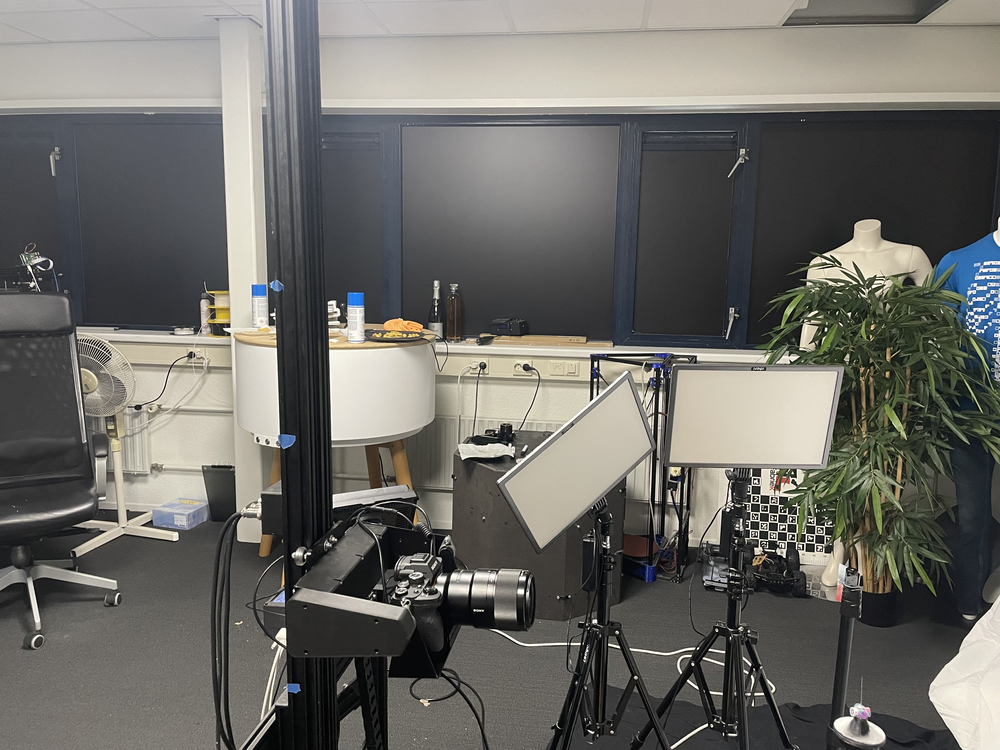
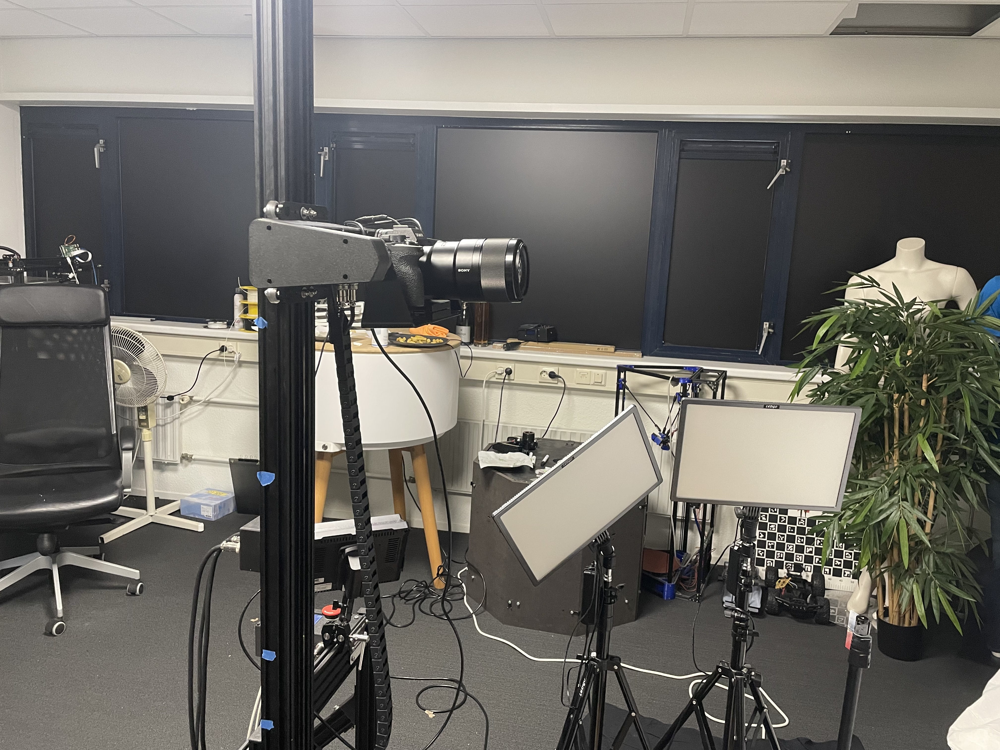
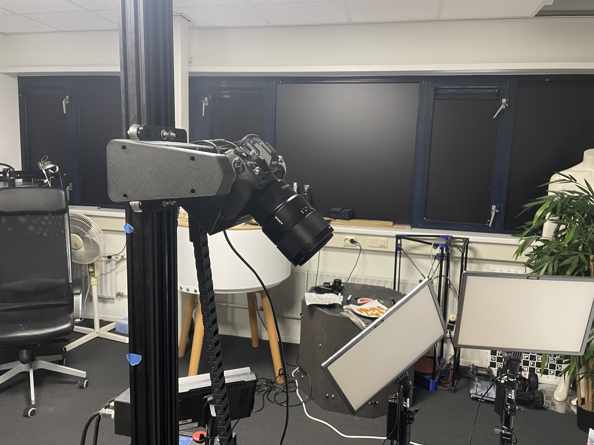
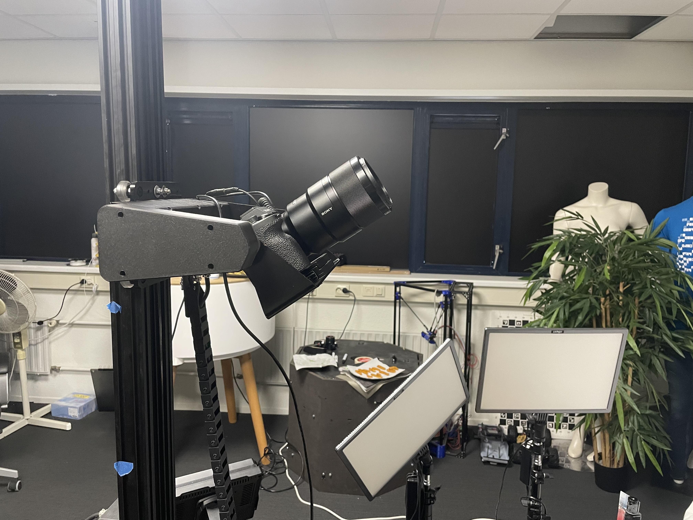

# MARC 3D Scanner Application

## Table of Contents
- [Introduction](#introduction)
- [Features](#features)
- [Hardware](#hardware)
  - [Expected commitment time](#expected-commitment-time)
  - [Get started](#getting-started)
- [Software](#software)
  - [Get started](#getting-started)
  - [User interface](#ui)
  - [Usage](#usage)
      - [Manual keyframes](#manual-keyframes)
      - [Automatic keyframes](#automatic-keyframes)
  - [Dependencies](#dependencies)
- [Hardware](#hardware)
- [License](#license)

## Introduction

The MARC (Motorised Alternate Reality Capture) 3D Scanner provides an opportunity for affordable and accessible 3D scanning. MARC has a PyQt GUI, allowing users to dynamically change and customize the scanning procces and initiate scanning cycles to create realistic 3D models. It integrates with Slack for real-time notifications.

MARC uses Photogrammetry to scan objects. The object spins on a turntable while the camera makes pictures from different heights and angles. These pictures are then put in software that creates a 3D model. And finaly are cleaned by real people.
Keyframes are the combination of height and angle for a position. There can be an unlimited amount of keyframes, wich can be cycled through for a perfect 360 view of an object. (In this case a curly fry)

Here are some pictures of MARC:


<table>
  <tr>
    <td>
      
    </td>
    <td>
      
    </td>
    <td>
      
    </td>
  </tr>
</table>

Watch our [production video](https://we.tl/t-bFW5XTTR4l) for a detailed demonstration.

# Features
  
  - **Height control**: The scanner can move up and down with a range of 180 centimeters.
  
  - **Tilt control**: The scanner can move its tilthead both clockwise and counterclockwise.
  
  - **Turntable control**: The scanner can turn its turntable at different speeds.
  
  - **Physical emergencystop button**: Button to stop all functionalities.

  - **Stop switches at the top and bottom**: Can stop the height motor if it overshoots.

See the scanner movents here:

<table>
  <tr>
    <td>
      
    </td>
    <td>
      
    </td>
    <td>
      
    </td>
    <td>
      
    </td>
  </tr>
</table>

  
  - **Real-time Control**: Adjust scanner parameters such as height and tilt angle in real-time using a graphical interface.
  
  - **Keyframe Management**: Easily dynamically create, edit and delete keyframes to define scanning positions and settings using a graphical interface.
  
  - **Scanning Cycles**: Initiate scanning cycles with the click of a button, and monitor progress with real-time Slack notifications.
  
  - **Pictures per keyframe**: Edit the amount of pictures taken with each keyframe in real time.
  
  - **Wait times**: Edit the time the scanner waits before and after taking a picture before doing anything else.
  
  - **Zero Position**: Consistent camera zero position
  
  - **Keyframe Calculator**: Automatically calculate and add keyframes based on predefined scanning patterns, enhancing efficiency.

# Hardware

  ## Expected commitment time

  In our experience, the marc takes 6 hours to build. Of cource your skill level has a huge impact on this, but with the documentation our guess is about 6 hours.

  ## Getting started

  - **Step 1**: Order the neseccary parts [here]().
  - **Step 2**: Build the frame for MARC using [this]() help file.
  - **Step 3**: Connect all the electronics using [this]() schematic.
  - **Step 4**: Combine the frame with the electronics.
  
# Software
  ## Getting Started

  1. Clone this repository to your Raspberry Pi.
  2. Install the required dependencies (see [Dependencies](#dependencies)). (Trouble installing PyQt5? Read [this](https://www.pythonguis.com/installation/install-pyqt5-raspberry-pi/) article)
```Python
sudo apt install python3-pyqt5
pip install slack
```
  3. Set up the slack bot with [this](https://medium.com/applied-data-science/how-to-build-you-own-slack-bot-714283fd16e5) tutorial. (Optional) If you decide not to use this feature you will have to manually delete the slack code.
  4. Change the slackToken to your own. This has to be done in the constants file, after that in the cycle class, you should delete all the code that has to do with slack messaging.
```Python
slackToken = <"youToken">
```
  5. Change the distance variable to the distance between the object and the tilt point. This can also be done in the constants file.
```Python
objDistance = <"yourDistanceInCm">
```
  7. Run the main application using Python.

  ## UI
  
  See the UI design here:
  
  <table>
    <tr>
      <td>
        
      </td>
      <td>
        
      </td>
      <td>
        
      </td>
    </tr>
  </table>
  
  ## Usage
  
  ### Manual keyframes
  
  1. Launch the application.
  2. Correctly connect the camera to the Raspbarry Pi.
  3. Manage keyframes via the "KEYFRAME MENU" button: add, edit, delete. Or use the "QUICK KEYFRAME" button on the main screen to add the current height and tilt to a keyframe.(see [UI](#UI))
  4. Adjust wait times and pictures per keyframe as needed. (see [UI](#UI))
  5. Click "START CYCLE" to initiate a scanning cycle. (see [UI](#UI)) 
  6. Wait for the results!
  
  ### Automatic keyframes
  **WIP**
  
  ## Dependencies
  
  The following dependencies are required to run the application:
  
  - Python 3
  - PyQt5
  - Slack API (for sending messages to Slack)
  - JSON (for storing keyframe data)

## License

This application is provided under the [MIT License](LICENSE).


## Contributions

Contributions to this codebase are welcome. You can enhance existing features, improve the user interface, fix issues, or add new functionalities. Feel free to open pull requests and contribute to the project's development.

Thank you for choosing the MARC 3D Scanner Application. Happy scanning!
