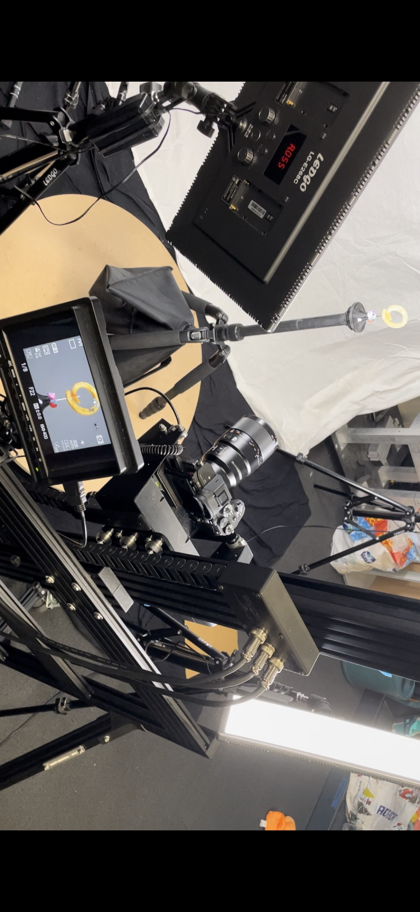
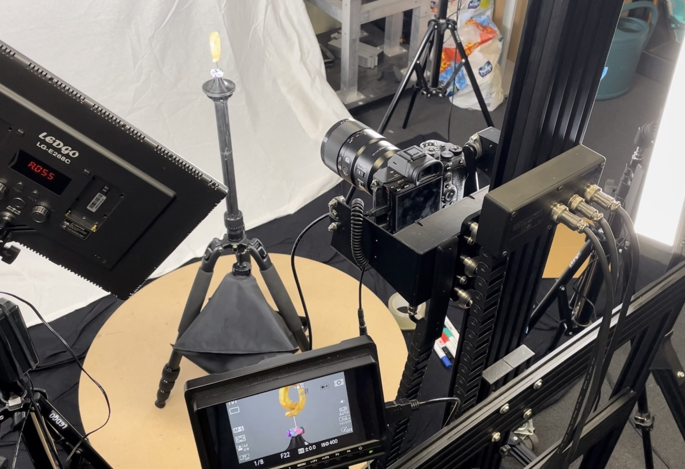
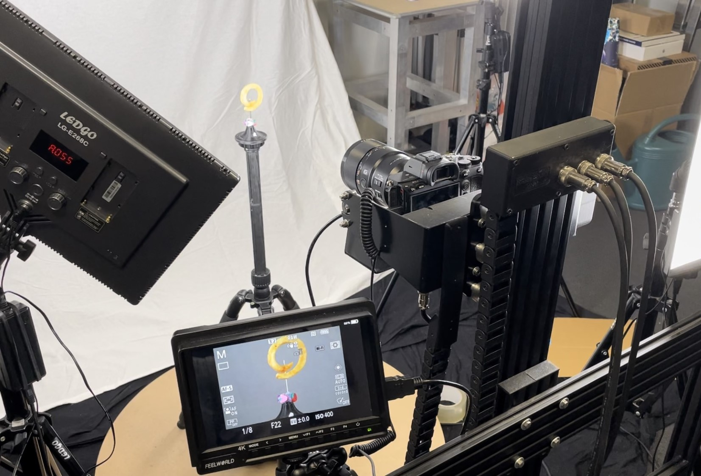
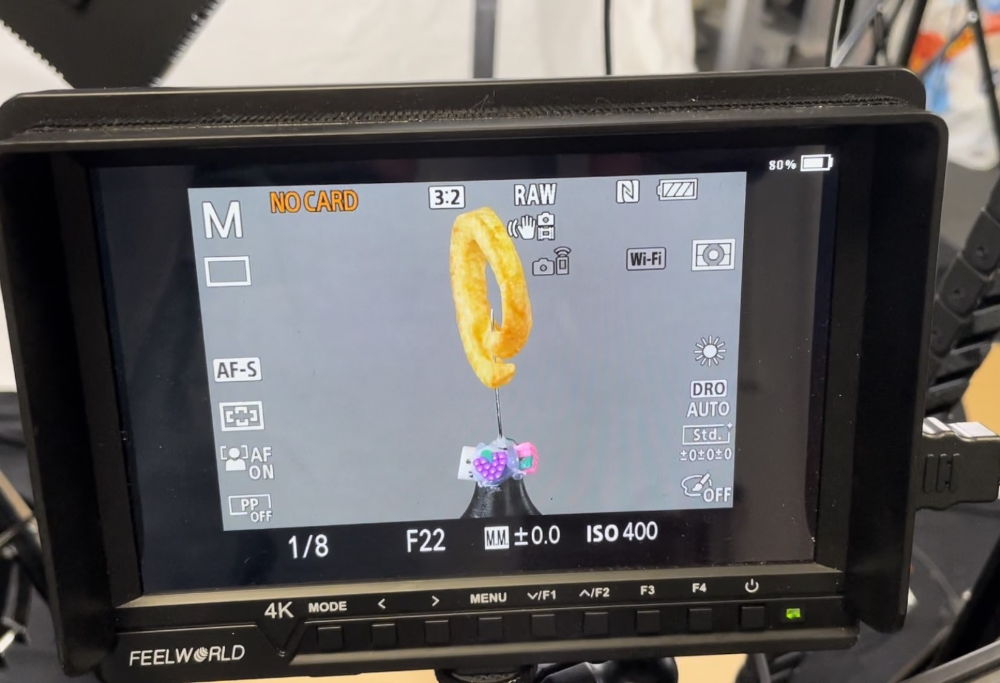
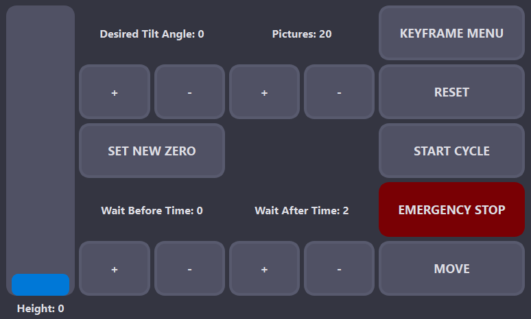
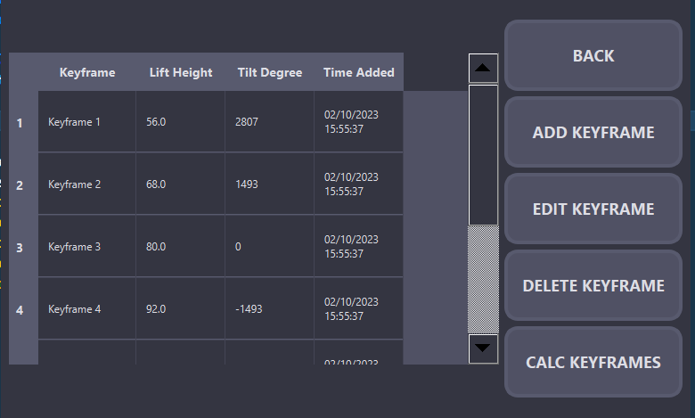
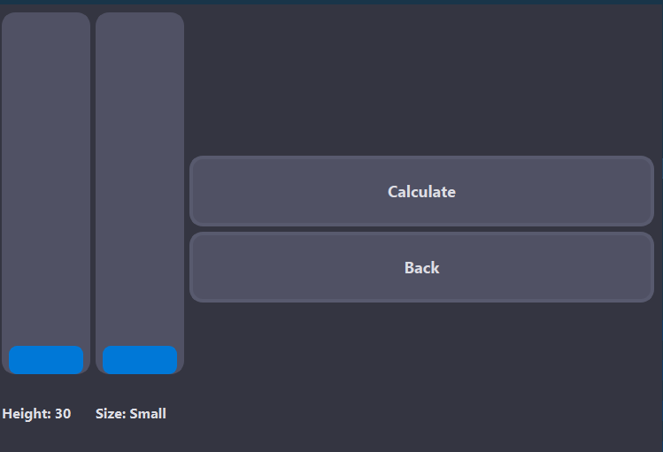

# MARC 3D Scanner Application

## Table of Contents
- [Introduction](#introduction)
- [Software](#software)
  - [Features](#features)
  - [Getting Started](#getting-started)
  - [Class Overview](#class-overview)
    - [`cycleThread`](#cyclethread)
    - [`MainWindow`](#mainwindow)
    - [`NewKeyframeWindow`](#newkeyframewindow)
    - [`EditKeyframeWindow`](#editkeyframewindow)
    - [`KeyframeCalculator`](#keyframecalculator)
  - [Usage](#usage)
  - [Dependencies](#dependencies)
  - [Contributions](#contributions)
- [Hardware](#hardware)
- [License](#license)

## Introduction

The MARC (Motorised Alternate Reality Capture) 3D Scanner provides an opportunity for affordable and accessible 3D scanning. MARC has a PyQt GUI, allowing users to dynamically change and customize the scanning procces and initiate scanning cycles to create realistic 3D models. It integrates with Slack for real-time notifications.

MARC uses Photogrammetry to scan objects. The object spins on a turntable while the camera makes pictures from different heights and angles. These pictures are then put in software that creates a 3D model. And finaly are cleaned by real people.
Keyframes are the combination of height and angle for a position. There can be an unlimited amount of keyframes, wich can be cycled through for a perfect 360 view of an object. (In this case a curly fry)

See [here](https://github.com/MeIorito/MARCPRIV/blob/f18d6a332a76eb8f18d45768995e26d3b8c86d63/explenation.md) for the explenation file for more in depth explenation.

Here are some pictures of MARC:



<table>
  <tr>
    <td>
      
    </td>
    <td>
      
    </td>
    <td>
      
    </td>
  </tr>
</table>

Watch our [production video](https://we.tl/t-bFW5XTTR4l) for a detailed demonstration.

# Software

  ## Features
  
  - **Real-time Control**: Adjust scanner parameters such as height and tilt angle in real-time using a graphical interface.
  
  - **Keyframe Management**: Easily dynamically create, edit and delete keyframes to define scanning positions and settings using a graphical interface.
  
  - **Scanning Cycles**: Initiate scanning cycles with the click of a button, and monitor progress with real-time Slack notifications.
  
  - **Pictures per keyframe**: Edit the amount of pictures taken with each keyframe in real time.
  
  - **Wait times**: Edit the time the scanner waits before and after taking a picture before doing anything else.
  
  - **Zero Position**: Set a new reference position (zero) for the scanner to start scanning cycles from. 
  
  - **Keyframe Calculator**: Automatically calculate and add keyframes based on predefined scanning patterns, enhancing efficiency.
  
  ## Getting Started

  1. First set up the hardware. (see [Hardware](#hardware)).
  2. Clone this repository to your Raspberry Pi.
  3. Install the required dependencies (see [Dependencies](#dependencies)). (Trouble installing PyQt5? Read [this](https://www.pythonguis.com/installation/install-pyqt5-raspberry-pi/) article)
```Python
sudo apt install python3-pyqt5
pip install slack
```
  4. Set up the slack bot with [this](https://medium.com/applied-data-science/how-to-build-you-own-slack-bot-714283fd16e5) tutorial. (Optional) If you decide not to use this feature you will have to manually delete the slack code.
  5. Change the slackToken to your own. Line 23
```Python
slackToken = <"youToken">
```
  6. Change the distance variable to the distance between the object and the tilt point. Line 30
```Python
objDistance = <"yourDistanceInCm">
```
  8. Run the application using Python.

  ## UI
  
  See the UI design here:
  
  <table>
    <tr>
      <td>
        
      </td>
      <td>
        
      </td>
      <td>
        
      </td>
    </tr>
  </table>
  
  ## Usage
  
  ### Manual keyframes
  
  1. Launch the application.
  2. Ensure the scanner is at its lowest position and the camera is level.
  3. Manage keyframes via the "KEYFRAME MENU" button: add, edit, delete. (see [UI](#UI))
  4. Adjust wait times and pictures per keyframe as needed. (see [UI](#UI))
  5. Click "START CYCLE" to initiate a scanning cycle. (see [UI](#UI)) 
  6. Use "SET NEW ZERO" to set a new tilt reference position if needed. (see [UI](#UI))
  
  ### Automatic keyframes
  
  1. Launch the application.
  2. Ensure the scanner is at its lowest position and the camera is level.
  3. Let the scanner calculate the keyframes based on the height and size of the object by clicking on the "CALCULATE " button. (see [UI](#UI))
  4. Adjust wait times and pictures per keyframe as needed. (see [UI](#UI))
  5. Click "START CYCLE" to initiate a scanning cycle. (see [UI](#UI)) 
  6. Use "SET NEW ZERO" to set a new tilt reference position if needed. (see [UI](#UI))
  
  ## Class Overview
  
  ### `cycleThread`
  
  The `cycleThread` class manages scanning cycles, handling scanner movement, image capture, and Slack status updates without freezing the GUI. Keyframe data and scanning parameters are loaded from a settings file.
  
  ### `MainWindow`
  
  The `MainWindow` class is the central GUI window of the application. It provides the following features:
  
  - Real-time controls for adjusting scanner parameters.
  - Initiating scanning cycles with real-time Slack notifications.
  - Keyframe management, including adding, editing, and deleting keyframes.
  - Wait time management, before and after taking a picture.
  - Setting a new reference position (zero) for the tilt position.
  - Emergency stop functionality.
  
  ### `NewKeyframeWindow`
  
  The `NewKeyframeWindow` class allows users to create and add new keyframes to the scanning process. Users can specify the desired height and tilt angle for each keyframe. Multiple keyframes can be added, and they are stored in a JSON settings file.
  
  ### `EditKeyframeWindow`
  
  The `EditKeyframeWindow` class enables users to edit existing keyframes. It provides controls to adjust the height and tilt angle of selected keyframes. Edits are saved to the settings file.
  
  ### `KeyframeCalculator`
  
  The `KeyframeCalculator` class is a separate window for calculating and adding keyframes based on predefined scanning patterns. It performs trigonometric calculations to determine keyframe positions based on scanner parameters. The calculated keyframes are stored in the settings file for later use.
  
  
  ## Dependencies
  
  The following dependencies are required to run the application:
  
  - Python 3
  - PyQt5
  - Slack API (for sending messages to Slack)
  - JSON (for storing keyframe data)
  

# Hardware

## Features
  
  - **Height control**: The scanner can move up and down with a range of 180 centimeters.
  
  - **Tilt control**: The scanner can move its tilthead both clockwise and counterclockwise.
  
  - **Turntable control**: The scanner can turn its turntable.
  
  - **Physical emergencystop button**: This button stops all the power to the motors.

  - **Stop switches at the top and bottom**: Can stop the height motor if it overshoots.

See the scanner movents here:

**Pictures**

## License

This application is provided under the [MIT License](LICENSE).


## Contributions

Contributions to this codebase are welcome. You can enhance existing features, improve the user interface, fix issues, or add new functionalities. Feel free to open pull requests and contribute to the project's development.

Thank you for choosing the MARC 3D Scanner Application. Happy scanning!
